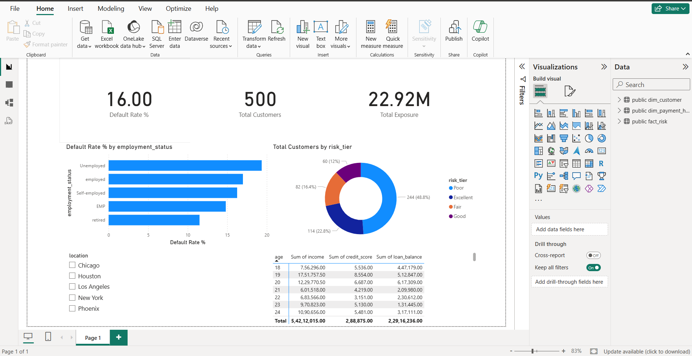

# 📊 End-to-End Credit Risk & Loan Delinquency Analytics Pipeline

An end-to-end credit risk analytics system built to analyze portfolio default exposure. This project features automated data cleaning and feature engineering in **Python (Pandas)**, a custom Star Schema data warehouse with DBA audit features in **PostgreSQL**, and an interactive executive dashboard in **Power BI**.

---

## Dashboard Preview



---

## Key Project Highlights & Business Impact
* **Portfolio Coverage:** Modeled and analyzed credit behavior across 500+ customer accounts.
* **Automated Data Quality:** Designed custom SQL audit views (`v_data_quality_audit`) to catch missing values and foreign key anomalies.
* **Risk Tiering:** Built custom DAX metrics and Python credit risk logic to segment balances by default likelihood.

---

## System Architecture & Workflow
[Raw CSV Data]
▼
[Python ETL Pipeline] ➔ (Median Imputation, Cleaning, Star Schema Generation)
▼
[PostgreSQL Data Warehouse] ➔ (Star Schema, Indexes, Audit Views, Analytical SQL)
▼
[Power BI Dashboard] ➔ (DAX KPIs, Interactive Filters, Portfolio Exposure Charts)


---

## Tech Stack & Key Features
Tool,Focus Area,Applied Techniques & Features
| **Python** | ETL Data Pipeline | Pandas DataFrames, group-wise median imputation, `pd.cut()` risk bucket creation |
| **PostgreSQL** | Data Warehousing & DBA | Star Schema modeling (`dim_customer`, `fact_risk`), Indexes, SQL Views, Window Functions (`RANK()`) |
| **Power BI** | Business Intelligence | DAX measures (`DISTINCTCOUNT`, `SUM`, `DIVIDE`), star-schema modeling, interactive slicers |

---

## Repository Structure
```text
credit-risk-analytics-pipeline
├── data
│   ├── processed
│   └── raw
├── dashboard
│   ├── credit_risk_dashboard.pbix
│   └── dashboard_preview.png
├── scripts
│   └── etl_pipeline.py
├── sql
│   ├── analytics_queries.sql
│   └── schema.sql
└── README.md


**Core Analytical Queries (SQL Snippet)**
## Risk Exposure & Default Rate by Employment Status 
SELECT 
    c.employment_status,
    COUNT(f.customer_id) AS total_customers,
    SUM(f.delinquent_account) AS total_defaults,
    ROUND(AVG(f.delinquent_account) * 100, 2) AS default_rate_pct,
    ROUND(AVG(f.loan_balance), 2) AS avg_loan_balance
FROM fact_risk f
JOIN dim_customer c ON f.customer_id = c.customer_id
GROUP BY c.employment_status
ORDER BY default_rate_pct DESC;

How to Run This Project
Run Python ETL:
python scripts/etl_pipeline.py

Build Database:
Run sql/schema.sql inside your PostgreSQL GUI, import the clean CSVs from data/processed/, then execute sql/analytics_queries.sql.

Open Dashboard:
Open dashboard/credit_risk_dashboard.pbix in Power BI Desktop to inspect the visualizations and DAX measures.
